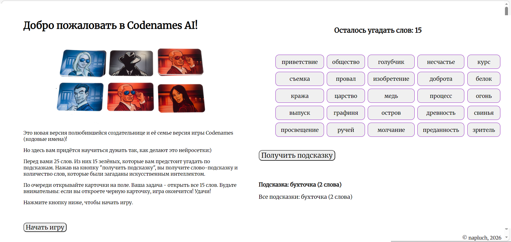

# Codenames Ai
Игра Codenames с подсказками от нейросети. Пользователь угадывает зеленые слова по подсказкам, стараясь избегать черных и оранжевых слов. Подсказки генерируются с помощью статической модели ruscorpora_upos_cbow_300_20_2019 (обучена на НКРЯ, содержит 189 млн слов, дата создания Январь 2019) 



## Функционал
Программа генерирует игровое поле 5Х5 ячеек, каждую ячейку заполняет словом из своей базы данных. База данных содержит в себе 2500 частотных существиетельных НКРЯ.
Рандомным образом из этих 25 слов на поле выбираются 15 зеленых -- тех, которые нужно будет угадать пользователю, и 2 черных -- тех, которые угадывать нельзя. Остальные 8 карточек являются нейтральными, оранжевыми.
Далее программа выбирает наилучшую подсказку для пары или тройки слов из зеленых. Алгоритм нахождения лучшей подсказки:

    1. векторизует каждое слово из пары или тройки
    2. считает средний вектор этих слов
    3. берет 20 ближайших кандидатов на подсказку из модели к полученноему серднему вектору 
    4. проверяет, что кандидат не является словом из поля, а также подсказкой, которая была дана ранее
    5. считает score кандидата-подсказки по формуле: benefit - 2.5 * fall_black - fall_orange, где
    benefit -- средняя косинусная близость кандидата-подсказки ко всем словам набора
    fall_black -- максимальная косинусная близость к черному слову
    fall_orange -- максимальная косинусная близость к оранжевому слову
    (Данная формула не имеет глубокого смысла, ее задача сильно штрафовать за близость к черному слову и не сильно, но штрафовать за близость к оранжевому)

Таким образом, перебирая все варианты двоек или троек программа находит подсказку с наибольшим score. Эта подсказка выдается пользователю. Далее пользователь может перевернуть несколько слов из поля и узнать их цвет.
Также пользователь может запросить еще подсказку. Подсказки генерируются пока есть неугаданные слова, каждая подсказка выдается пользователю только один раз, на экране ведется список всех выданных подсказок

Игра заканчивается в двух случаях:
1) Если пользователь перевернул одну из двух черных карточек (пользователь проиграл)
2) Если пользователь угадал все зеленые карточки (пользователь выиграл)

<!--Установка-->
## Установка (win)
Пожалуй, я напишу это для себя в будущем 

1. Клонирование репозитория
```git clone ```
2. Переход в директорию codenames_ai
```cd codenames_ai ```
3. Создание вирутального окружения
```python -m venv .venv ```
4. Активация виртуального окружения
```activate .venv/Scripts/activate.bat ```
5. Установка зависимостей
```pip install -r requirements.txt ```
6. Запуск программы
```python app.py ```

Игра написана на Python 3.12.3

Деплой: если я побежу (победю!) pythonanywhere, то игра будет здесь https://napluch.pythonanywhere.com/
